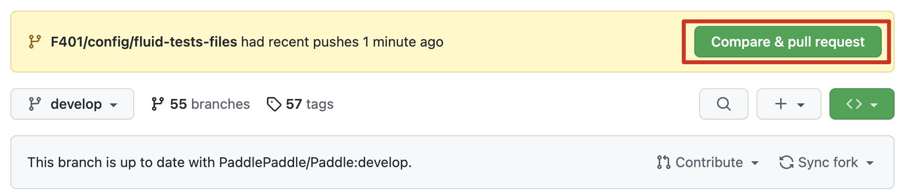

# 协作流程

## 加入 Cattidea

Flake8 小组整体的协作将会在 [Cattidea](https://github.com/cattidea) 组织中进行，以便相互之间协作，相关修改直接在 [cattidea/Paddle](https://github.com/cattidea/Paddle) **新建分支**修改即可，无需自己 fork。

## 环境准备

### 安装 Flake8

我们使用的是 flake8 4.0.1 版本

```bash
pip install flake8==4.0.1
```

### Clone Paddle

```bash
# 直接 clone cattidea 下的 Paddle 即可
git clone https://github.com/cattidea/Paddle.git
# 切换到 Paddle 目录，之后所有操作默认在此目录执行
cd Paddle
# 设置 upstream 为 Paddle 官方 repo
git remote add upstream https://github.com/PaddlePaddle/Paddle.git
```

### 尝试下 Flake8 命令

```bash
# 直接在 Paddle 根目录尝试运行
flake8 .
# 不出意外是没有任何输出的，说明现在 flake8 全部文件都正常～
```

### 安装 pre-commit

向 Paddle 贡献，pre-commit 的安装是必须的，如果不安装的话很容易会因为代码风格问题在 CI 卡住。

```bash
# 安装 pre-commit
pip install pre-commit==2.17.0
# 在 Paddle 注册 pre-commit
pre-commit install
```

## 开始修改代码～

这里以解决 `python/paddle/fluid/tests/unittests/collective` 目录全部 F401 错误码为例（[#46615](https://github.com/PaddlePaddle/Paddle/pull/46615)）

### 创建新分支

```bash
# 创建新分支前，需要确认当前是在 develop 分支
git branch
# 确认在 develop 后新建分支
git switch -c <branch_name>
# <branch_name> 需要替换成分支名，如 F401/fix/unittests-collective
# 在 flake8 协作过程中尽可能使用上述的 <做什么>/<fix 存量问题还是修改 config>/<修改范围> 格式来命名一个分支
# 能够避免大家的分支名冲突，也可以让大家一眼知道这个分支在修改什么
```

### 修改代码

这里可能做各种各样的修改，比如 F401 任务需要

```bash
autoflake --in-place --remove-all-unused-imports --exclude=__init__.py --recursive ./python/paddle/fluid/tests/unittests/collective/
```

这里利用 `autoflake` 将 `python/paddle/fluid/tests/unittests/collective/` 全部 F401 错误码都去除掉了～

之后我们就可以提交并 push 到远程仓库啦～

```bash
git commit -m 'some description of this commit'
git push origin <branch_name>
```

之后就可以去 [cattidea/Paddle](https://github.com/cattidea/Paddle) 提交 PR 啦～

不出意外你会在 repo 里看到一个弹出的 PR 提示：



此时直接点击 `Compare & pull request` 即可创建一个 PR。

## PR 规范

### PR 标题

本任务均以 `[CodeStyle]` 标志作为开头，如果确定是修改某一个错误码，则后面加上错误码，如 `[F401]`，之后加上修改的描述。如 `[CodeStyle][F401] remove unused imports in unittests/collective`

如果一个 PR 尚未完成，则在最前面加上 `[WIP]` 标志，如 `[WIP][CodeStyle][F401] remove unused imports in unittests/collective`，在完成后移除 `[WIP]` 标志

### PR 描述

首先要遵守 Paddle PR 模板，否则无法通过 CheckPRTemplate 这一 CI 流水线。

在 `Describe` 部分详细描述做了什么修改，如果自动修改直接粘贴命令即可，如果手动修改应当详细说明修改原因和修改方式。

此外增加一项 `Related links`，使用**列表**放一些链接，需包含 tracking issue、修复了的 issue 等等。

下面是一个模板：

````md
<!-- Demo: https://github.com/PaddlePaddle/Paddle/pull/24810 -->

### PR types

<!-- One of [ New features | Bug fixes | Function optimization | Performance optimization | Breaking changes | Others ] -->

Others

### PR changes

<!-- One of [ OPs | APIs | Docs | Others ] -->

Others

### Describe

<!-- Describe what this PR does -->

修复 `python/paddle/fluid/tests/unittests/collective/` 目录 F401 unused import 存量 python 代码

```bash
autoflake --in-place --remove-all-unused-imports --exclude=__init__.py --recursive ./python/paddle/fluid/tests/unittests/collective/
```

### Related links

-  Flake8 tracking issue: #46039
-  F401 project: https://github.com/orgs/cattidea/projects/4/views/1
-  配置文件更新: #46616
-  fixes https://github.com/cattidea/paddle-flake8-project/issues/28
````

这样一个 PR 就创建完成啦～

之后等 CI 查看是否出现问题即可～
